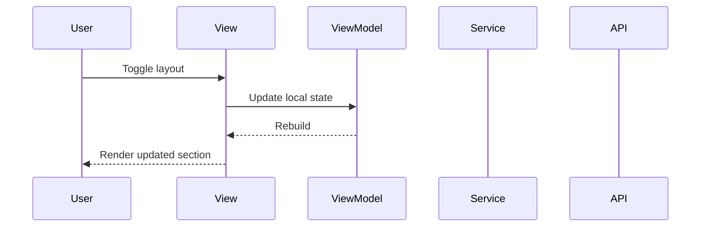

# 🔧 Wire collection widgets showcase

## 🔗 Dependencies
> Which tasks need to be completed first (if any)?

- [ ] None
- [ ] None

## 🎯 End Goal
Styling view renders a collection widgets showcase section with sample data in multiple layouts.

## 📍 Currently
> What is the current state?

- Styling view showcases category widgets only

## 🎯 Should
> What should the state be after implementation?

- Styling view includes a collection widgets section
- Header, toolbar, and section render in bento/list/grid layouts

## 🔌 Integration Points
> What needs to be connected?

### View ↔ ViewModel Connections

| View | ViewModel | Connection |
|------|-----------|------------|
| StylingView | StylingViewModel | No new data wiring; static showcase |

### Component ↔ State Connections

| Component | State Source | Data Flow |
|-----------|--------------|-----------|
| TCollectionToolbar | Local state | Update search/sort/filter/layout |
| TCollectionSection | Local sample data | Render items per layout |

## 📈 Data Flow
> How does data flow through the integrated system?

## ✅ Acceptance Criteria
> How do we verify the integration works?

- [ ] Collection widgets section renders in the styling view
- [ ] Layout toggle updates the section layout
- [ ] No runtime errors introduced

## ⚠️ Constraints
> What limitations or constraints exist?

- [ ] No business logic added to the view

## 🧪 Integration Tests
> What integration tests verify the wiring?

- [ ] `Given styling view open When toggling layout Then section updates`

## 📝 Notes
> Additional context for integration

Showcase is static with sample data; no service wiring required.
