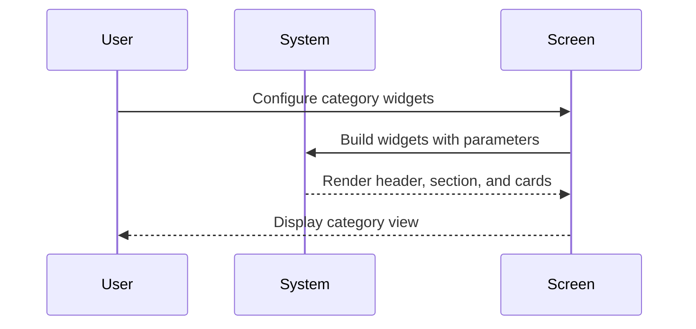

# 🧩 Category widgets UI components

Use this template for creating UI components/widgets and views in isolation. Components should be stateless with primitive parameters.

---

## 🔗 Dependencies
> Which tasks need to be completed first (if any)?

- [ ] None

## 🗺️ User Journey
> What do the complete sequences look like with mermaid diagrams?

### Developer can display category views with header, sections, and cards

1. 👤 Developer composes category page layout with the provided widgets.
2. 🧠 System renders header, section, and cards using theme-aware styles.
3. 🎨 Screen shows categories in horizontal or grid layouts with show-all behavior.



---

## 🧩 Components/Widgets
> What components/widgets need to be created and how do they look?

### TCategoryHeader

**Purpose:** Large category header card with title, description, optional background image, and gradient styling.

**Props/Parameters:**
- `title`: String - header title text
- `description`: String - header description text
- `backgroundImage`: ImageProvider? - optional background image
- `gradient`: Gradient? - optional background gradient
- `borderRadius`: double - corner radius
- `contentPadding`: EdgeInsetsGeometry - internal padding

**ASCII Representation:**
```
┌─────────────────────────────────────────┐
│  Title                                  │
│  Description text                        │
└─────────────────────────────────────────┘
```

**States:**
- Default: gradient background with text
- Hover: N/A
- Active: N/A
- Disabled: N/A
- Error: N/A

---

### TCategoryCard

**Purpose:** Compact category tile with title, optional icon/image, gradient styling, and tap/hover feedback.

**Props/Parameters:**
- `title`: String - card title text
- `icon`: IconData? - optional icon
- `backgroundImage`: ImageProvider? - optional background image
- `gradient`: Gradient? - optional background gradient
- `borderRadius`: double - corner radius
- `onPressed`: VoidCallback? - tap callback
- `contentPadding`: EdgeInsetsGeometry - internal padding

**ASCII Representation:**
```
┌───────────────┐
│  Icon  Title  │
└───────────────┘
```

**States:**
- Default: gradient background with icon and title
- Hover: hover highlight via InkWell
- Active: splash feedback on tap
- Disabled: no callback, muted styles
- Error: N/A

---

### TCategorySection

**Purpose:** Section header with title/caption + trailing actions and a list of category items in horizontal or grid layout with show-all behavior.

**Props/Parameters:**
- `title`: String - section title
- `caption`: String? - optional caption
- `trailing`: Widget? - optional trailing action widget
- `layout`: TCategorySectionLayout - horizontal or grid
- `itemCount`: int - total item count
- `itemBuilder`: Widget Function(BuildContext, int) - item builder
- `maxItems`: int? - limit before show-all
- `maxLines`: int - rows in horizontal layout
- `onShowAll`: VoidCallback? - show-all callback

**ASCII Representation:**
```
┌─────────────────────────────────────────┐
│  Title / Caption        [Show all]      │
│  [Card][Card][Card] ...                 │
└─────────────────────────────────────────┘
```

**States:**
- Default: renders items with configured layout
- Hover: N/A
- Active: show-all tap expands or triggers callback
- Disabled: N/A
- Error: N/A

---

## 🎨 Views
> What views/pages need to be created and how do they look?

### N/A

**Purpose:** Not applicable for this task.

**Route:** N/A

**ASCII Representation:**
```
┌─────────────────────────────────────────┐
│ N/A                                     │
└─────────────────────────────────────────┘
```

**View States:**
- Loading: N/A
- Empty: N/A
- Error: N/A
- Success: N/A

**Components Used:**
- TCategoryHeader
- TCategorySection
- TCategoryCard

---

## 🎨 Design Tokens
> What (existing) project design tokens are used, created, or updated?

```json
{
  "colors": [
    "theme.colorScheme.primary",
    "theme.colorScheme.secondary",
    "theme.colorScheme.surface",
    "theme.colorScheme.onPrimary",
    "theme.colorScheme.onSurface",
    "theme.colorScheme.border"
  ],
  "spacing": [8, 12, 16, 24],
  "radius": [8, 12, 16]
}
```

---

## 📋 Storybook/Widgetbook
> Add components to the project's component showcase page

- [ ] Add TCategoryHeader to Storybook/Widgetbook
- [ ] Add TCategorySection to Storybook/Widgetbook
- [ ] Add TCategoryCard to Storybook/Widgetbook
- [ ] Document all component states and variants
- [ ] Ensure primitive parameters only (no custom objects)
