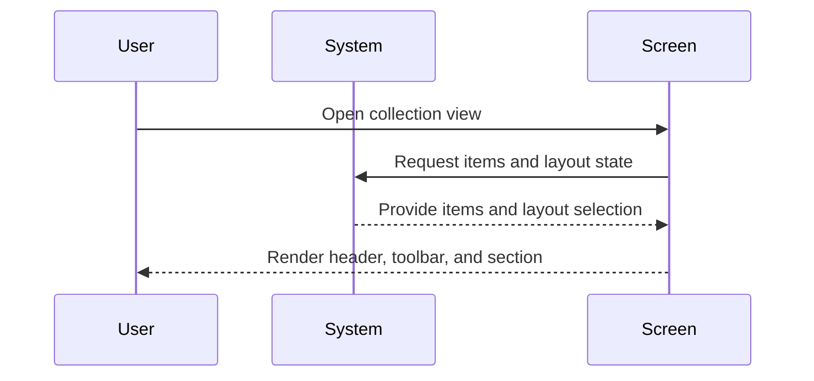

# 🧩 Collection widgets UI components

## 🔗 Dependencies
> Which tasks need to be completed first (if any)?

- [ ] None

## 🗺️ User Journey
> What do the complete sequences look like with mermaid diagrams?

### Collection showcase {Developer} is able to display collection items in multiple layouts

1. 👤 User opens a collection screen.
2. 🧠 System provides collection items and layout state.
3. 🎨 Screen renders header, toolbar, and section in bento/list/grid layout.



---

## 🧩 Components/Widgets
> What components/widgets need to be created and how do they look?

### TCollectionHeader

**Purpose:** Display collection title/description with optional background image.

**Props/Parameters:**
- `title`: String - Primary heading
- `description`: String - Supporting text
- `backgroundImage`: ImageProvider? - Optional background image
- `borderRadius`: double - Corner radius

**ASCII Representation:**
```
┌─────────────────────────────────────────┐
│  Title                                  │
│  Description text...                    │
└─────────────────────────────────────────┘
```

**States:**
- Default: Gradient background, text visible
- Hover: N/A
- Active: N/A
- Disabled: N/A
- Error: N/A

### TCollectionToolbar

**Purpose:** Provide search, sort, filter, and layout toggle controls.

**Props/Parameters:**
- `searchQuery`: String - Current search query
- `onSearchChanged`: ValueChanged<String> - Search input handler
- `sortLabel`: String - Current sort label
- `sortOptions`: List<String> - Sort option labels
- `onSortSelected`: ValueChanged<String> - Sort selection handler
- `filterLabel`: String - Current filter label
- `filterOptions`: List<String> - Filter option labels
- `onFilterSelected`: ValueChanged<String> - Filter selection handler
- `layout`: TCollectionSectionLayout - Current layout selection
- `onLayoutChanged`: ValueChanged<TCollectionSectionLayout> - Layout toggle handler

**ASCII Representation:**
```
┌─────────────────────────────────────────┐
│ [Search]   [Sort] [Filter] [Layout]     │
└─────────────────────────────────────────┘
```

**States:**
- Default: All controls enabled
- Hover: Hover feedback on buttons
- Active: Selected layout button highlighted
- Disabled: Disabled buttons when callbacks are null
- Error: N/A

### TCollectionSection

**Purpose:** Render collection items in bento/list/grid layouts.

**Props/Parameters:**
- `title`: String - Section title
- `caption`: String? - Optional subtitle
- `layout`: TCollectionSectionLayout - Layout selection
- `itemCount`: int - Number of items
- `itemBuilder`: Widget Function(BuildContext, int) - Item builder
- `itemSizeBuilder`: double Function(int)? - Size weights for bento layout
- `gridCrossAxisCount`: int - Grid columns
- `gridMainAxisSpacing`: double - Grid row spacing
- `gridCrossAxisSpacing`: double - Grid column spacing
- `gridChildAspectRatio`: double - Grid item ratio
- `gridMainAxisExtent`: double? - Fixed grid height
- `sectionSpacing`: double - Header/body spacing

**ASCII Representation:**
```
┌─────────────────────────────────────────┐
│ Section Title            [Actions]      │
│ Caption                                 │
│ ┌────────┐ ┌──────┐ ┌─────────┐         │
│ │ Item   │ │ Item │ │ Item    │         │
│ └────────┘ └──────┘ └─────────┘         │
└─────────────────────────────────────────┘
```

**States:**
- Default: Layout renders according to selection
- Hover: Item hover feedback (per item)
- Active: Selected layout visible
- Disabled: N/A
- Error: N/A

### TCollectionCard

**Purpose:** Render collection item in card format.

**Props/Parameters:**
- `title`: String - Primary text
- `subtitle`: String? - Supporting text
- `meta`: String? - Metadata text
- `thumbnail`: ImageProvider? - Optional thumbnail
- `onPressed`: VoidCallback? - Tap handler
- `borderRadius`: double - Corner radius

**ASCII Representation:**
```
┌─────────────────────────────────────────┐
│ [Img] Title                              │
│       Subtitle                           │
│       Meta                               │
└─────────────────────────────────────────┘
```

**States:**
- Default: Card with optional thumbnail
- Hover: Hover feedback
- Active: Tap feedback
- Disabled: Visual muted state when onPressed is null
- Error: N/A

### TCollectionListItem

**Purpose:** Render collection item in list format.

**Props/Parameters:**
- `title`: String - Primary text
- `subtitle`: String? - Supporting text
- `meta`: String? - Metadata text
- `leading`: Widget? - Optional leading widget
- `trailing`: Widget? - Optional trailing widget
- `onPressed`: VoidCallback? - Tap handler

**ASCII Representation:**
```
┌─────────────────────────────────────────┐
│ [Lead] Title                    [More]  │
│       Subtitle           Meta           │
└─────────────────────────────────────────┘
```

**States:**
- Default: Row with leading/trailing
- Hover: Hover feedback
- Active: Tap feedback
- Disabled: Muted state when onPressed is null
- Error: N/A

---

## 🎨 Views
> What views/pages need to be created and how do they look?

### StylingView

**Purpose:** Showcase collection widgets in the template styling view.

**Route:** N/A (template showcase)

**ASCII Representation:**
```
┌─────────────────────────────────────────────────────────────┐
│ Collection Widgets                                          │
│ ┌─────────────────────────────────────────────────────────┐ │
│ │ TCollectionHeader                                      │ │
│ └─────────────────────────────────────────────────────────┘ │
│ ┌─────────────────────────────────────────────────────────┐ │
│ │ TCollectionToolbar                                     │ │
│ └─────────────────────────────────────────────────────────┘ │
│ ┌─────────────────────────────────────────────────────────┐ │
│ │ TCollectionSection (bento/list/grid)                   │ │
│ └─────────────────────────────────────────────────────────┘ │
└─────────────────────────────────────────────────────────────┘
```

**View States:**
- Loading: N/A
- Empty: N/A
- Error: N/A
- Success: Widgets render with sample data

**Components Used:**
- TCollectionHeader
- TCollectionToolbar
- TCollectionSection
- TCollectionCard
- TCollectionListItem

---

## 🎨 Design Tokens
> What (existing) project design tokens are used, created, or updated?

```json
{
  "spacing": [8, 12, 16, 24],
  "radius": [8, 12, 16],
  "typography": ["textTheme.large", "textTheme.p", "textTheme.muted"],
  "colors": ["colorScheme.primary", "colorScheme.secondary", "colorScheme.border"]
}
```

---

## 📋 Storybook/Widgetbook
> Add components to the project's component showcase page

- [ ] Add collection widgets to the template styling view showcase
- [ ] Document all component states and variants
- [ ] Ensure primitive parameters only (no custom objects)
