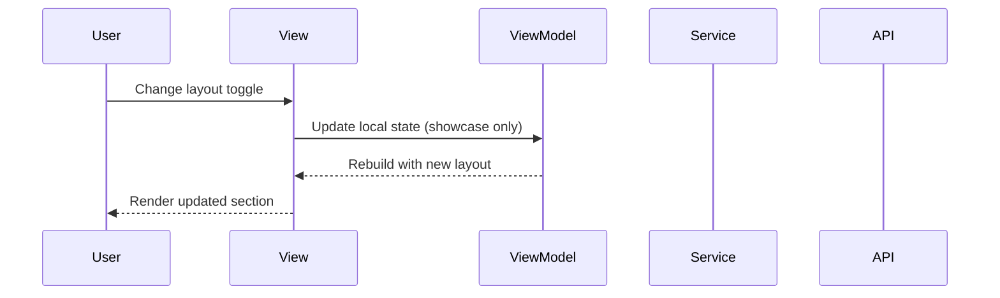

# 🔧 Wire collection widgets to showcase

## 🔗 Dependencies
> Which tasks need to be completed first (if any)?

- [ ] 001-add-collection-widgets-components
- [ ] N/A (no business-logic task)

## 🎯 End Goal
Collection widgets render in the template styling view with sample data across bento, list, and grid layouts.

## 📍 Currently
> What is the current state?

- Collection widgets do not exist in turbo_widgets
- Styling view only showcases category widgets

## 🎯 Should
> What should the state be after implementation?

- Collection widgets are available in turbo_widgets
- Styling view showcases header, toolbar, and section in each layout
- Layout toggle callbacks are wired to placeholder actions

## 🔌 Integration Points
> What needs to be connected?

### View ↔ ViewModel Connections

| View | ViewModel | Connection |
|------|-----------|------------|
| StylingView | StylingViewModel | No new data wiring; static showcase |

### Component ↔ State Connections

| Component | State Source | Data Flow |
|-----------|--------------|-----------|
| TCollectionToolbar | Local state | Update search/sort/filter/layout values |
| TCollectionSection | Local sample data | Render items per layout |

## 📈 Data Flow
> How does data flow through the integrated system?

## ✅ Acceptance Criteria
> How do we verify the integration works?

- [ ] User can view collection widgets in bento, list, and grid layouts
- [ ] Layout toggle updates the rendered section
- [ ] Theme-aware styles render correctly in light/dark themes
- [ ] No runtime errors in the styling view

## ⚠️ Constraints
> What limitations or constraints exist?

- [ ] Widgets use only primitive parameters and callbacks
- [ ] No business logic added to the view

## 🧪 Integration Tests
> What integration tests verify the wiring?

- [ ] `Given styling view open When toggling layout Then section updates`

## 📝 Notes
> Additional context for integration

This is a showcase-only wiring; production data wiring is out of scope.
