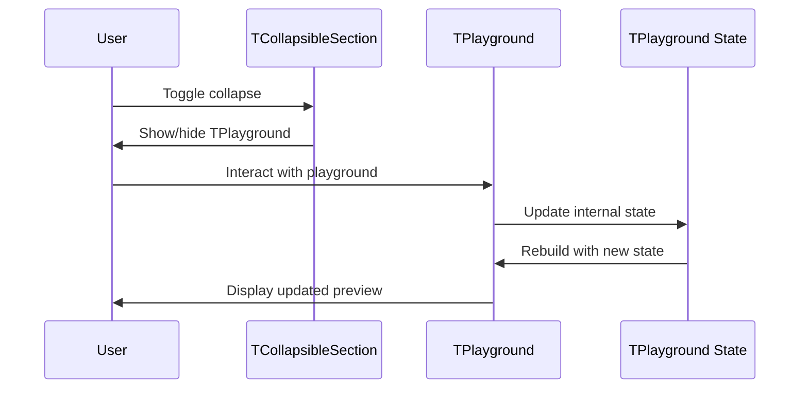

# 🔧 Update StylingView to use new TPlayground API

Use this template for wiring components to business logic and integration work. Assumes components are created and business logic is tested.

**Title Format**: `🔧 Wire <feature> to business logic`

**Examples**:
- 🔧 Wire user profile to ProfileViewModel
- 🔧 Wire checkout flow to PaymentService

---

## 🔗 Dependencies
> Which tasks need to be completed first (if any)?

- [x] 001-refactor-playground-generic-state-refactor-widget
- [x] 002-refactor-playground-generic-state-cleanup-viewmodel

## 🎯 End Goal
> What is the tangible outcome of this integration?

`StylingView` uses the new `TPlayground` API with simplified integration - only providing a `parametersBuilder` and `childBuilder`.

## 📍 Currently
> What is the current state?

```dart
// Current complex integration with 20+ properties:
MultiListenableBuilder(
  listenables: [
    model.screenType,
    model.isGeneratorOpen,
    model.userRequest,
    // ... 8 more listenables
  ],
  builder: (context, _, __) => TPlayground(
    screenType: model.screenType.value,
    onScreenTypeChanged: model.setScreenType,
    isGeneratorOpen: model.isGeneratorOpen.value,
    onToggleGenerator: model.toggleGenerator,
    userRequest: model.userRequest.value,
    onUserRequestChanged: model.setUserRequest,
    // ... 15+ more property/callback pairs
    childBuilder: (context, params) {
      // ...
    },
  ),
)
```

## 🎯 Should
> What should the state be after implementation?

```dart
// Simplified integration:
TPlayground<TPlaygroundParameterModel>(
  parametersBuilder: () => const TPlaygroundParameterModel.empty(),
  childBuilder: (context, params) {
    final theme = ShadTheme.of(context);
    return Center(
      child: Text(
        'Add your component here',
        style: theme.textTheme.muted,
      ),
    );
  },
)
```

## 🔌 Integration Points
> What needs to be connected?

### View ↔ ViewModel Connections

| View | ViewModel | Connection |
|------|-----------|------------|
| StylingView | StylingViewModel | Only `isPlaygroundExpanded` for collapsible section |

### Component ↔ State Connections

| Component | State Source | Data Flow |
|-----------|--------------|-----------|
| TPlayground | Internal state | Self-managed |
| TCollapsibleSection | StylingViewModel.isPlaygroundExpanded | External toggle |

## 📈 Data Flow
> How does data flow through the integrated system?



## ✅ Acceptance Criteria
> How do we verify the integration works?

- [x] StylingView compiles without errors
- [x] TPlayground displays and functions correctly
- [x] Parameter panel updates preview correctly
- [x] Screen type selector works
- [x] Dark mode toggle works
- [x] Preview mode (device frame) works
- [x] Copy prompt functionality works
- [x] Collapsible section still expands/collapses

## ⚠️ Constraints
> What limitations or constraints exist?

- [x] Remove all references to removed view model state
- [x] Remove MultiListenableBuilder wrapping TPlayground (no longer needed)

## 🧪 Integration Tests
> What integration tests verify the wiring?

- [ ] `Given StylingView is displayed When user toggles playground collapse Then TPlayground visibility changes`

## 📝 Notes
> Additional context for integration

The `MultiListenableBuilder` wrapper around `TPlayground` should be removed entirely since the widget now manages its own state. Only the outer `ValueListenableBuilder` for `isPlaygroundExpanded` should remain to control the collapsible section.
