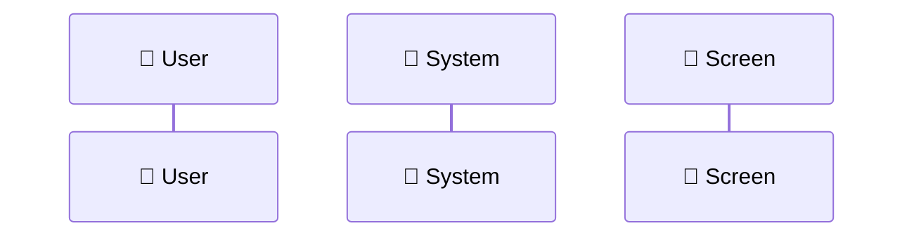

# ✨ Story Template

Use this template for user-facing features with clear business value.

**Title Format**: `✨ <Actor> is able to <capability>`

**Examples**:
- ✨ User is able to reset password via email
- ✨ Admin is able to manage user roles

---

## 🔗 Dependencies
> Which tasks need to be completed first (if any)?

- [ ] <!-- REPLACE: Task IDs that block this work -->

## 👤 User Story
> Who benefits and what do they want to achieve?

```text
As a {Actor}, I want to [action], so that [benefit/value].
```

## 🚀 End Goal
> What is the tangible, measurable end goal?

<!-- REPLACE: Clear, SMART end goal statement -->

## 📍 Currently
> What is the current state?

<!-- REPLACE: Description of current state -->

## 🎯 Should
> What should the state be after implementation?

<!-- REPLACE: Description of target state -->

## 🔧 Considerations (Non-Functional)
> What non-functional requirements apply (performance, security, UX, etc.)?

<!-- REPLACE: Non-functional requirements -->

## 🗺️ User Journeys
> What do different scenarios of { 👤 User, 🧠 System, 🎨 Screen } steps look like?

1. 👤 User [verb] ...
2. 🧠 System [verb] ...
3. 🎨 Screen [verb] ...



## 🎨 UI
> What does the updated UI look like in ASCII?

```text
<!-- REPLACE: ASCII representation of the updated UI -->
```

## 📈 Data Flow Diagrams
> How does data flow?

```mermaid
<!-- REPLACE: Full data flow diagram -->
```

## ✅ Acceptance Criteria
> How do we measure successful achievement of end goal?

- [ ] <!-- REPLACE: Criterion 1 -->
- [ ] <!-- REPLACE: Criterion 2 -->

## ⚠️ Constraints
> What limitations or constraints exist?

- [ ] <!-- REPLACE: Constraint 1 -->
- [ ] <!-- REPLACE: Constraint 2 -->

## 🏗️ Project Conventions
> What are the relevant project's folder structure, naming conventions, and patterns?

### Folder Structure

<!-- REPLACE: Relevant folder structure -->

### Naming Conventions

<!-- REPLACE: File naming, class naming, variable naming conventions -->

### Code Patterns

<!-- REPLACE: Patterns used in this project -->

## 📚 Existing Patterns
> What similar implementations exist in the codebase that can be referenced?

### Similar Features
| Feature | Location | Relevance |
|---------|----------|-----------|
| <!-- REPLACE --> | <!-- REPLACE --> | <!-- REPLACE --> |

### Reusable Components

<!-- REPLACE: Existing components/services that can be reused -->

## 📦 Preferred Packages
> What packages does the user prefer or require?

- [ ] <!-- REPLACE: Package name --> - <!-- REPLACE: Purpose -->
