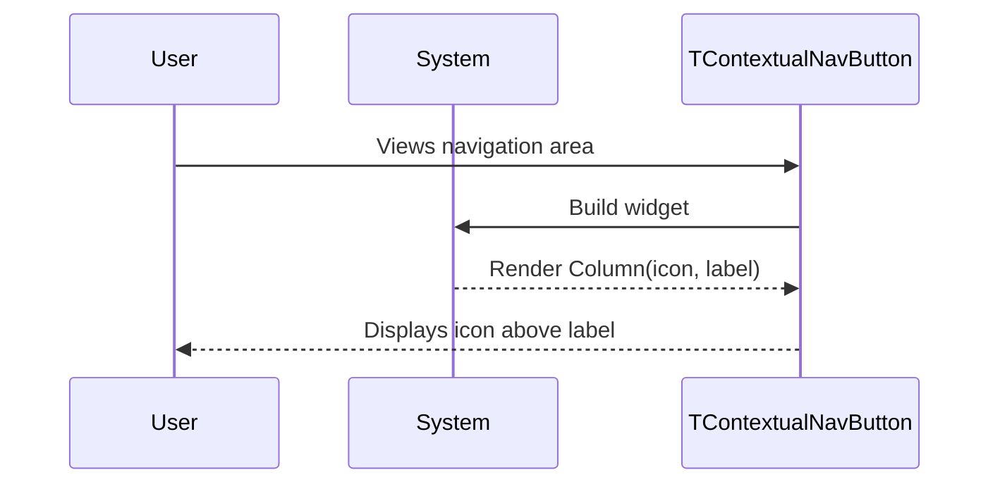

# 🧩 Components Template

Use this template for creating UI components/widgets and views in isolation. Components should be stateless with primitive parameters.

**Title Format**: `🧩 <Feature> UI components`

**Examples**:
- 🧩 User profile UI components
- 🧩 Checkout flow UI components

---

## 🔗 Dependencies
> Which tasks need to be completed first (if any)?

- [ ] None

## 🗺️ User Journey
> What do the complete sequences look like with mermaid diagrams?

### User views contextual navigation button

1. 👤 User sees contextual navigation area
2. 🧠 System renders TContextualNavButton
3. 🎨 Screen displays icon above label in vertical stack



---

## 🧩 Components/Widgets
> What components/widgets need to be created and how do they look?

### TContextualNavButton (Update)

**Purpose:** Display a navigation button with icon above label in vertical layout

**Props/Parameters:**
- `config`: TButtonConfig - Button configuration (icon, label, onPressed, etc.)
- `showLabel`: bool - Whether to show the label text (default: true)
- `variant`: ShadButtonVariant - Button style variant (default: outline)
- `size`: ShadButtonSize - Button size (default: sm)
- `iconSize`: double? - Optional icon size override

**ASCII Representation:**
```
┌─────────────────┐
│                 │
│     [Icon]      │
│                 │
│     Label       │
│                 │
└─────────────────┘
```

**Current State (Horizontal):**
```
┌──────────────────────────┐
│  [Icon]   Label          │
└──────────────────────────┘
```

**Target State (Vertical):**
```
┌────────────────┐
│                │
│     [Icon]     │
│                │
│     Label      │
│                │
└────────────────┘
```

**States:**
- Default: Icon and label displayed vertically, muted colors
- Hover: Background highlight via ShadButton
- Active: Primary variant styling
- Disabled: Reduced opacity
- Error: N/A

---

## 🎨 Views
> What views/pages need to be created and how do they look?

No new views required. Widget is used within existing navigation components.

---

## 🎨 Design Tokens
> What (existing) project design tokens are used, created, or updated?

```json
{
  "spacing": {
    "iconLabelGap": 4
  },
  "typography": {
    "labelStyle": "theme.textTheme.small"
  }
}
```

---

## 📋 Storybook/Widgetbook
> Add components to the project's component showcase page

- [ ] Update TContextualNavButton in existing showcase to reflect vertical layout
- [ ] Document showLabel variations
- [ ] Ensure primitive parameters only (no custom objects)
