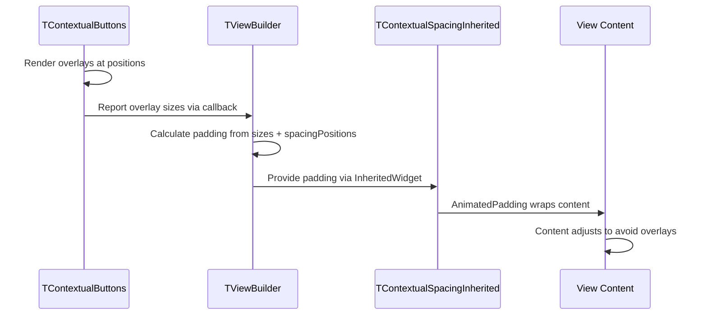

# ⚙️ Business Logic Template

Use this template for implementing ViewModels, Services, APIs, DTOs, and other business logic with unit tests. No UI work in this task type.

**Title Format**: `⚙️ <Feature> business logic`

**Examples**:
- ⚙️ User authentication business logic
- ⚙️ Payment processing business logic

---

## 🔗 Dependencies
> Which tasks need to be completed first (if any)?

- [ ] 001-components-contextual-nav-button-vertical

## 📈 Data Flow Diagrams
> How does data flow in ASCII/Mermaid?



## 📦 Packages
> What packages need to be installed?

| Package | Version | Purpose |
|---------|---------|---------|
| N/A | N/A | No new packages required |

---

## 🧠 ViewModels
> What ViewModels need to be created and/or updated?

N/A - This task focuses on widget infrastructure.

---

## ⚙️ Services
> What Services need to be created and/or updated?

N/A - Logic is contained within widgets.

---

## 🌐 APIs
> What APIs need to be created and/or updated?

N/A

---

## 📦 DTOs
> What DTOs need to be created and/or updated?

### TContextualSpacingData

```yaml
name: TContextualSpacingData
description: Holds measured overlay sizes for each position
locations:
  - turbo_widgets/lib/src/models/
fields:
  top:
    description: Height of top overlay
    type: double
    required: true
    nullable: false
    default: 0.0
    example: 56.0
  bottom:
    description: Height of bottom overlay
    type: double
    required: true
    nullable: false
    default: 0.0
    example: 64.0
  left:
    description: Width of left overlay
    type: double
    required: true
    nullable: false
    default: 0.0
    example: 80.0
  right:
    description: Width of right overlay
    type: double
    required: true
    nullable: false
    default: 0.0
    example: 80.0
```

---

## 🏷️ Enums
> What enums need to be created and/or updated?

N/A - Uses existing TContextualPosition enum

---

## 📌 Constants
> What constants are needed?

- [ ] **TContextualSpacingDefaults**
    - [ ] `defaultSpacingPositions` = `{TContextualPosition.left, TContextualPosition.top, TContextualPosition.right}`

---

## 🌍 ARBs (Localization)
> What localized strings are needed?

N/A

---

## 🛠️ Utils
> What utility classes are needed?

N/A

---

## 🧪 TDD Gherkin Unit Tests
> What cases verify our end goal is reached?

### TContextualSpacing Tests

- [ ] `Given TViewBuilder with default spacingPositions When top overlay is 56px Then content has 56px top padding`
- [ ] `Given TViewBuilder with default spacingPositions When bottom overlay is 64px Then content has 0px bottom padding (bottom not in default set)`
- [ ] `Given TViewBuilder with spacingPositions including bottom When bottom overlay is 64px Then content has 64px bottom padding`
- [ ] `Given TViewBuilder When overlay size changes Then padding animates with same duration as contextual buttons`
- [ ] `Given TViewBuilder with left overlay 80px When spacingPositions excludes left Then content has 0px left padding`
- [ ] `Given no overlays active Then content has 0px padding on all sides`

---

## Implementation Details

### TViewBuilder Updates

Add parameter:
```dart
final Set<TContextualPosition> spacingPositions;
```

Default:
```dart
spacingPositions = const {
  TContextualPosition.left,
  TContextualPosition.top,
  TContextualPosition.right,
}
```

### TContextualButtons Updates

Add size measurement for each position using GlobalKey + WidgetsBinding.addPostFrameCallback to measure rendered size.

Report sizes via callback:
```dart
typedef TContextualSizeCallback = void Function(TContextualSpacingData sizes);
```

### TContextualSpacingInherited

New InheritedWidget providing EdgeInsets padding to descendants:
```dart
class TContextualSpacingInherited extends InheritedWidget {
  final EdgeInsets padding;
  final Duration animationDuration;

  static EdgeInsets of(BuildContext context) {
    return context.dependOnInheritedWidgetOfExactType<TContextualSpacingInherited>()?.padding ?? EdgeInsets.zero;
  }
}
```

### Animation Timing

Match animation duration from TContextualButtonsConfig.animationDuration to ensure spacing changes sync with button transitions.
