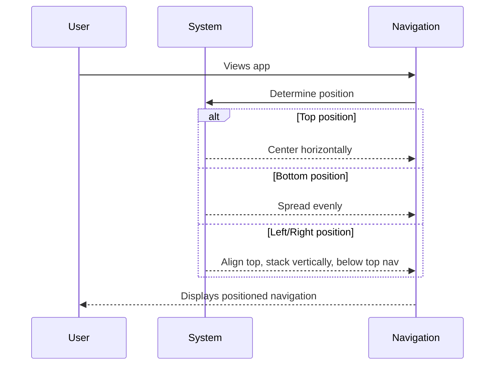

# 🧩 Components Template

Use this template for creating UI components/widgets and views in isolation. Components should be stateless with primitive parameters.

**Title Format**: `🧩 <Feature> UI components`

**Examples**:
- 🧩 User profile UI components
- 🧩 Checkout flow UI components

---

## 🔗 Dependencies
> Which tasks need to be completed first (if any)?

- [ ] 001-components-contextual-nav-button-vertical

## 🗺️ User Journey
> What do the complete sequences look like with mermaid diagrams?

### User views navigation in different positions

1. 👤 User sees app with contextual navigation
2. 🧠 System positions navigation based on location
3. 🎨 Screen displays navigation with correct alignment



---

## 🧩 Components/Widgets
> What components/widgets need to be created and how do they look?

### TContextualSideNavigation (Update)

**Purpose:** Display side navigation buttons aligned to top, starting below top navigation height

**Props/Parameters:**
- `buttons`: Map<String, TButtonConfig> - Button configurations
- `selectedKey`: String? - Currently selected button key
- `onSelect`: ValueChanged<String>? - Selection callback
- `showLabels`: bool - Whether to show labels (default: true)
- `padding`: EdgeInsets - Padding around navigation
- `spacing`: double - Spacing between buttons (default: 8)
- `topOffset`: double - Offset from top to avoid top navigation (default: 0)

**ASCII Representation:**
```
┌──────────────────────┐
│                      │  ← Top nav area
├──────────────────────┤
│  ┌──────┐            │
│  │ Icon │            │
│  │Label │            │
│  └──────┘            │
│                      │
│  ┌──────┐            │
│  │ Icon │            │
│  │Label │            │
│  └──────┘            │
│                      │
│  ...                 │
│                      │
└──────────────────────┘
```

**States:**
- Default: Buttons stacked vertically, aligned to top
- With top offset: Buttons start below specified offset
- Active: Selected button uses primary variant
- Inactive: Other buttons use ghost variant

### TContextualBottomNavigation (Update - No Changes Needed)

**Purpose:** Display bottom navigation buttons spread evenly

**Current behavior is correct:** Uses Row with Expanded children to spread items evenly.

**ASCII Representation:**
```
┌──────────────────────────────────────────────────┐
│  ┌──────┐    ┌──────┐    ┌──────┐    ┌──────┐   │
│  │ Icon │    │ Icon │    │ Icon │    │ Icon │   │
│  │Label │    │Label │    │Label │    │Label │   │
│  └──────┘    └──────┘    └──────┘    └──────┘   │
└──────────────────────────────────────────────────┘
```

### TContextualAppBar (Update - Verify Centering)

**Purpose:** Display top navigation buttons centered horizontally

**Current behavior should be verified:** Buttons should be centered, not left-aligned.

**ASCII Representation:**
```
┌──────────────────────────────────────────────────┐
│              ┌──────┐  ┌──────┐                  │
│              │ Icon │  │ Icon │                  │
│              │Label │  │Label │                  │
│              └──────┘  └──────┘                  │
└──────────────────────────────────────────────────┘
```

---

## 🎨 Views
> What views/pages need to be created and how do they look?

No new views required.

---

## 🎨 Design Tokens
> What (existing) project design tokens are used, created, or updated?

```json
{
  "spacing": {
    "sideNavTopOffset": "Derived from top navigation height"
  }
}
```

---

## 📋 Storybook/Widgetbook
> Add components to the project's component showcase page

- [ ] Update TContextualSideNavigation showcase with topOffset parameter
- [ ] Verify TContextualBottomNavigation spreads evenly in showcase
- [ ] Verify TContextualAppBar centers items in showcase
- [ ] Ensure primitive parameters only (no custom objects)

---

## Implementation Notes

### Side Navigation Top Offset

The side navigation needs to receive the top navigation height to offset its content. This can be achieved by:

1. TContextualButtons measures top overlay height
2. Passes height to side navigation via parameter
3. Side navigation applies top padding equal to this height

### TContextualButtons Integration

Update TContextualButtons to:
1. Measure top overlay height after render
2. Pass this height to left/right positioned content
3. Use LayoutBuilder or GlobalKey to measure
