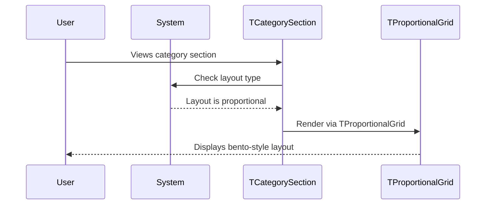

# 🧩 Components Template

Use this template for creating UI components/widgets and views in isolation. Components should be stateless with primitive parameters.

**Title Format**: `🧩 <Feature> UI components`

**Examples**:
- 🧩 User profile UI components
- 🧩 Checkout flow UI components

---

## 🔗 Dependencies
> Which tasks need to be completed first (if any)?

- [ ] None

## 🗺️ User Journey
> What do the complete sequences look like with mermaid diagrams?

### User views category section with proportional layout

1. 👤 User sees category section
2. 🧠 System renders TCategorySection with proportional layout
3. 🎨 Screen displays items in bento-style grid



---

## 🧩 Components/Widgets
> What components/widgets need to be created and how do they look?

### TCategorySection (Update)

**Purpose:** Add proportional layout option that renders items via TProportionalGrid

**Props/Parameters:**
- `layout`: TCategorySectionLayout - Layout type (horizontal, grid, proportional)
- `items`: List of category items
- Other existing parameters remain unchanged

**ASCII Representation (Proportional Layout):**
```
┌──────────────────────────────────────────┐
│ ┌────────────────┐  ┌──────┐  ┌──────┐   │
│ │                │  │      │  │      │   │
│ │     Large      │  │ Med  │  │ Med  │   │
│ │      Item      │  │      │  │      │   │
│ │                │  ├──────┴──┴──────┤   │
│ │                │  │     Wide       │   │
│ └────────────────┘  └────────────────┘   │
└──────────────────────────────────────────┘
```

**States:**
- Horizontal: Items scroll horizontally
- Grid: Items in uniform grid cells
- Proportional: Items in treemap/bento layout based on weights

### TCategorySectionLayout (Update)

**Purpose:** Add proportional option to layout enum

**Current Values:**
- `horizontal`
- `grid`

**New Value:**
- `proportional`

---

## 🎨 Views
> What views/pages need to be created and how do they look?

No new views required.

---

## 🎨 Design Tokens
> What (existing) project design tokens are used, created, or updated?

No new design tokens required. Uses existing TProportionalGrid styling.

---

## 📋 Storybook/Widgetbook
> Add components to the project's component showcase page

- [ ] Add TCategorySection proportional layout to showcase
- [ ] Show comparison of horizontal, grid, and proportional layouts
- [ ] Ensure primitive parameters only (no custom objects)

---

## Implementation Notes

### Layout Enum Update

Add to TCategorySectionLayout:
```dart
enum TCategorySectionLayout {
  horizontal,
  grid,
  proportional,
}
```

### TCategorySection Build Method

Update switch statement to handle proportional:
```dart
switch (layout) {
  case TCategorySectionLayout.horizontal:
    return _buildHorizontal();
  case TCategorySectionLayout.grid:
    return _buildGrid();
  case TCategorySectionLayout.proportional:
    return _buildProportional();
}
```

### Proportional Build Method

Use existing TProportionalGrid widget:
```dart
Widget _buildProportional() {
  return TProportionalGrid(
    items: items.map((item) => TProportionalItem(
      weight: item.weight ?? 1.0,
      child: itemBuilder(item),
    )).toList(),
  );
}
```
