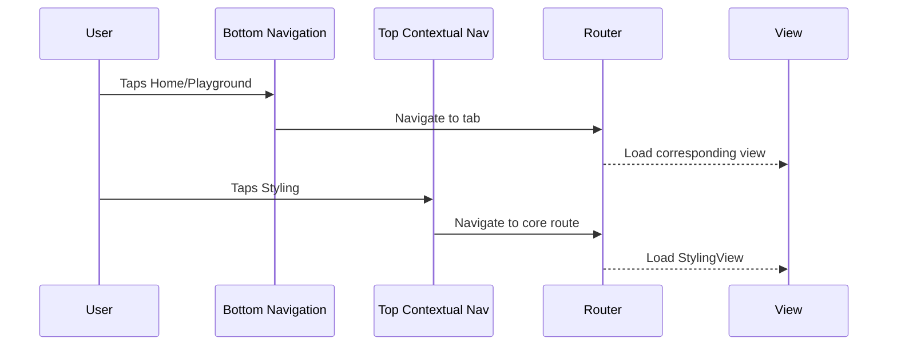

# ⚙️ Business Logic Template

Use this template for implementing ViewModels, Services, APIs, DTOs, and other business logic with unit tests. No UI work in this task type.

**Title Format**: `⚙️ <Feature> business logic`

**Examples**:
- ⚙️ User authentication business logic
- ⚙️ Payment processing business logic

---

## 🔗 Dependencies
> Which tasks need to be completed first (if any)?

- [ ] None

## 📈 Data Flow Diagrams
> How does data flow in ASCII/Mermaid?



## 📦 Packages
> What packages need to be installed?

| Package | Version | Purpose |
|---------|---------|---------|
| N/A | N/A | No new packages required |

---

## 🧠 ViewModels
> What ViewModels need to be created and/or updated?

### ShellViewModel (Update)

Update to handle new navigation structure:
- Bottom tabs: Home, Playground
- Top contextual nav: Styling

---

## ⚙️ Services
> What Services need to be created and/or updated?

### ContextualButtonsService (Update)

Register contextual buttons for:
- Top position: Styling button (navigates to /styling)
- Configure per-route basis

---

## 🌐 APIs
> What APIs need to be created and/or updated?

N/A

---

## 📦 DTOs
> What DTOs need to be created and/or updated?

N/A

---

## 🏷️ Enums
> What enums need to be created and/or updated?

### NavigationTab (Update)

```yaml
name: NavigationTab
description: Bottom navigation tab identifiers
locations:
  - turbo_template/flutter-app/lib/core/infrastructure/enums/
values:
  home:
    description: Home tab showing category showcase
  playground:
    description: Playground tab for component testing
```

**Current values being removed:**
- `styling` (becomes top contextual nav, not a tab)

---

## 📌 Constants
> What constants are needed?

N/A

---

## 🌍 ARBs (Localization)
> What localized strings are needed?

N/A - Using existing strings

---

## 🛠️ Utils
> What utility classes are needed?

N/A

---

## 🧪 TDD Gherkin Unit Tests
> What cases verify our end goal is reached?

### Navigation Tests

- [ ] `Given user on Home tab When taps Playground tab Then navigates to PlaygroundView`
- [ ] `Given user on Playground tab When taps Home tab Then navigates to HomeView`
- [ ] `Given user on any tab When taps Styling contextual button Then navigates to StylingView`
- [ ] `Given user on StylingView When taps back Then returns to previous location`

---

## Implementation Details

### NavigationTab Enum Update

```dart
enum NavigationTab {
  home,
  playground,
}
```

### TRoute Updates

Update routing structure:
1. Remove styling from StatefulShellRoute branches
2. Add styling as core route (sibling to shell)
3. Move playground from home child to shell branch

```dart
// Shell branches (bottom nav)
branches: [
  StatefulShellBranch(routes: [homeRoute]),      // Home
  StatefulShellBranch(routes: [playgroundRoute]), // Playground
],

// Core routes (outside shell)
GoRoute(
  path: '/styling',
  builder: (context, state) => const StylingView(),
),
```

### ContextualButtonsService Updates

Register top contextual button for Styling:
```dart
contextualButtonsService.registerButtons(
  routePath: '/',
  buttons: TContextualButtonsConfig(
    top: {
      'styling': TButtonConfig(
        icon: Icons.palette,
        label: 'Styling',
        onPressed: () => router.go('/styling'),
      ),
    },
  ),
);
```

### ShellViewModel Updates

Update navigation handling:
- `currentTab` getter based on NavigationTab enum
- `onTabChanged` method for bottom nav selection
- Remove styling tab logic
