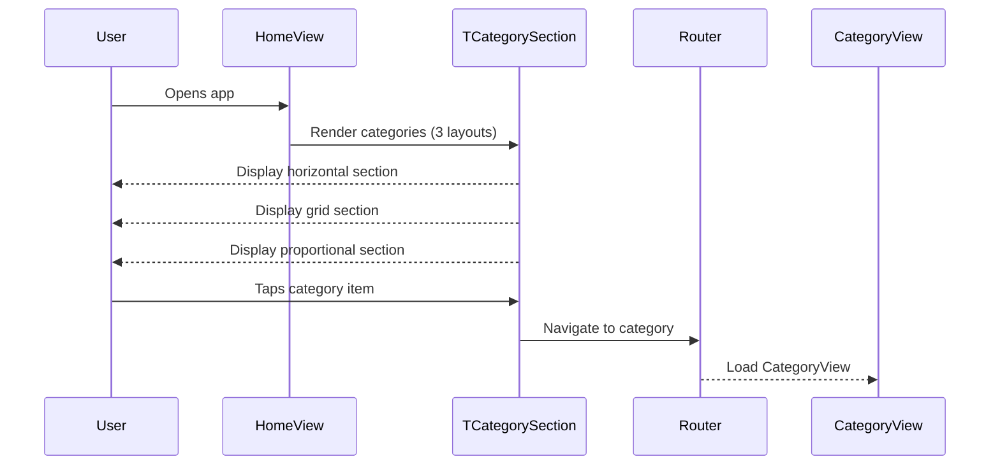

# 🧩 Components Template

Use this template for creating UI components/widgets and views in isolation. Components should be stateless with primitive parameters.

**Title Format**: `🧩 <Feature> UI components`

**Examples**:
- 🧩 User profile UI components
- 🧩 Checkout flow UI components

---

## 🔗 Dependencies
> Which tasks need to be completed first (if any)?

- [ ] 004-components-category-section-proportional
- [ ] 005-business-logic-navigation-routing

## 🗺️ User Journey
> What do the complete sequences look like with mermaid diagrams?

### User views Home page with category widgets

1. 👤 User opens app
2. 🧠 System renders Home view
3. 🎨 Screen displays category widgets with horizontal, grid, and proportional layouts
4. 👤 User taps a category item
5. 🧠 System navigates to Category page



---

## 🧩 Components/Widgets
> What components/widgets need to be created and how do they look?

### HomeView (Update)

**Purpose:** Demonstrate all category widget types with different layouts

**Props/Parameters:**
- Uses TViewBuilder with HomeViewModel

**ASCII Representation:**
```
┌──────────────────────────────────────────┐
│ [Top Contextual Nav - Styling button]    │
├──────────────────────────────────────────┤
│                                          │
│  ┌─ Horizontal Categories ─────────────┐ │
│  │ [Card] [Card] [Card] →              │ │
│  └─────────────────────────────────────┘ │
│                                          │
│  ┌─ Grid Categories ───────────────────┐ │
│  │ [Card] [Card] [Card]                │ │
│  │ [Card] [Card] [Card]                │ │
│  └─────────────────────────────────────┘ │
│                                          │
│  ┌─ Proportional Categories ───────────┐ │
│  │ [Large Card] [Med] [Med]            │ │
│  │              [Wide Card]            │ │
│  └─────────────────────────────────────┘ │
│                                          │
├──────────────────────────────────────────┤
│ [Home Tab] [Playground Tab]              │
└──────────────────────────────────────────┘
```

**States:**
- Loading: Shows loading indicators
- Loaded: Displays all category sections
- Error: Shows error message

---

## 🎨 Views
> What views/pages need to be created and how do they look?

### HomeView (Update)

Replace empty placeholder with category widget showcase:

1. **Horizontal TCategorySection**
   - Header: "Horizontal Layout"
   - Items: Sample category cards
   - Layout: TCategorySectionLayout.horizontal

2. **Grid TCategorySection**
   - Header: "Grid Layout"
   - Items: Sample category cards
   - Layout: TCategorySectionLayout.grid

3. **Proportional TCategorySection**
   - Header: "Proportional Layout"
   - Items: Sample category cards with weights
   - Layout: TCategorySectionLayout.proportional

Each category card navigates to CategoryView when tapped.

---

## 🎨 Design Tokens
> What (existing) project design tokens are used, created, or updated?

Uses existing design tokens from theme.

---

## 📋 Storybook/Widgetbook
> Add components to the project's component showcase page

Components used are already in showcase. This task focuses on view implementation.

---

## Implementation Notes

### HomeView Structure

```dart
TViewBuilder<HomeViewModel>(
  viewModelBuilder: () => HomeViewModel(),
  builder: (context, viewModel) => TSliverBody(
    slivers: [
      // Horizontal Categories
      SliverToBoxAdapter(
        child: TCategorySection(
          header: TCategoryHeader(title: 'Horizontal Layout'),
          layout: TCategorySectionLayout.horizontal,
          items: viewModel.horizontalItems,
          onItemTap: viewModel.navigateToCategory,
        ),
      ),
      // Grid Categories
      SliverToBoxAdapter(
        child: TCategorySection(
          header: TCategoryHeader(title: 'Grid Layout'),
          layout: TCategorySectionLayout.grid,
          items: viewModel.gridItems,
          onItemTap: viewModel.navigateToCategory,
        ),
      ),
      // Proportional Categories
      SliverToBoxAdapter(
        child: TCategorySection(
          header: TCategoryHeader(title: 'Proportional Layout'),
          layout: TCategorySectionLayout.proportional,
          items: viewModel.proportionalItems,
          onItemTap: viewModel.navigateToCategory,
        ),
      ),
    ],
  ),
);
```

### Sample Data

Create sample category items in HomeViewModel:
- 6 items for horizontal (scrollable)
- 6 items for grid (2x3)
- 4-5 items for proportional with varying weights

### Navigation

Each category item tap navigates to `/home/category/:id`
