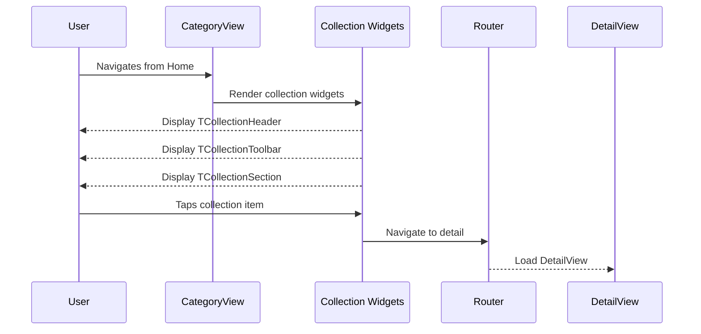

# 🧩 Components Template

Use this template for creating UI components/widgets and views in isolation. Components should be stateless with primitive parameters.

**Title Format**: `🧩 <Feature> UI components`

**Examples**:
- 🧩 User profile UI components
- 🧩 Checkout flow UI components

---

## 🔗 Dependencies
> Which tasks need to be completed first (if any)?

- [ ] 005-business-logic-navigation-routing

## 🗺️ User Journey
> What do the complete sequences look like with mermaid diagrams?

### User views Category page with collection widgets

1. 👤 User navigates from Home to Category page
2. 🧠 System renders Category view
3. 🎨 Screen displays collection widgets
4. 👤 User taps a collection item
5. 🧠 System navigates to Detail page



---

## 🧩 Components/Widgets
> What components/widgets need to be created and how do they look?

### CategoryView (Create)

**Purpose:** Demonstrate all collection widget types

**Props/Parameters:**
- Uses TViewBuilder with CategoryViewModel
- Receives category ID from route parameters

**ASCII Representation:**
```
┌──────────────────────────────────────────┐
│ [← Back]  [Top Contextual Nav]           │
├──────────────────────────────────────────┤
│                                          │
│  ┌─ TCollectionHeader ─────────────────┐ │
│  │ Category Title                      │ │
│  │ Subtitle / Description              │ │
│  └─────────────────────────────────────┘ │
│                                          │
│  ┌─ TCollectionToolbar ────────────────┐ │
│  │ [Filter] [Sort] [Search]            │ │
│  └─────────────────────────────────────┘ │
│                                          │
│  ┌─ TCollectionSection ────────────────┐ │
│  │ ┌────────────────────────────────┐  │ │
│  │ │ TCollectionListItem            │  │ │
│  │ │ Title, subtitle, trailing      │  │ │
│  │ └────────────────────────────────┘  │ │
│  │ ┌────────────────────────────────┐  │ │
│  │ │ TCollectionCard                │  │ │
│  │ │ Image, title, description      │  │ │
│  │ └────────────────────────────────┘  │ │
│  │ ...more items...                    │ │
│  └─────────────────────────────────────┘ │
│                                          │
├──────────────────────────────────────────┤
│ [Home Tab] [Playground Tab]              │
└──────────────────────────────────────────┘
```

**States:**
- Loading: Shows loading indicators
- Loaded: Displays collection widgets
- Empty: Shows empty state message
- Error: Shows error message

---

## 🎨 Views
> What views/pages need to be created and how do they look?

### CategoryView (Create)

New view demonstrating collection widgets:

1. **TCollectionHeader**
   - Title from category data
   - Optional subtitle/description

2. **TCollectionToolbar**
   - Filter button (demo only)
   - Sort button (demo only)
   - Search field (demo only)

3. **TCollectionSection with mixed items**
   - TCollectionListItem examples
   - TCollectionCard examples

Each collection item navigates to DetailView when tapped.

---

## 🎨 Design Tokens
> What (existing) project design tokens are used, created, or updated?

Uses existing design tokens from theme.

---

## 📋 Storybook/Widgetbook
> Add components to the project's component showcase page

Components used are already in showcase. This task focuses on view implementation.

---

## Implementation Notes

### CategoryView Structure

```dart
TViewBuilder<CategoryViewModel>(
  viewModelBuilder: () => CategoryViewModel(categoryId: categoryId),
  builder: (context, viewModel) => TSliverBody(
    slivers: [
      // Collection Header
      SliverToBoxAdapter(
        child: TCollectionHeader(
          title: viewModel.categoryTitle,
          subtitle: viewModel.categoryDescription,
        ),
      ),
      // Collection Toolbar
      SliverToBoxAdapter(
        child: TCollectionToolbar(
          onFilter: viewModel.onFilter,
          onSort: viewModel.onSort,
          onSearch: viewModel.onSearch,
        ),
      ),
      // Collection Section - List Items
      SliverToBoxAdapter(
        child: TCollectionSection(
          header: 'List Items',
          children: viewModel.listItems.map((item) =>
            TCollectionListItem(
              title: item.title,
              subtitle: item.subtitle,
              onTap: () => viewModel.navigateToDetail(item.id),
            ),
          ).toList(),
        ),
      ),
      // Collection Section - Cards
      SliverToBoxAdapter(
        child: TCollectionSection(
          header: 'Card Items',
          children: viewModel.cardItems.map((item) =>
            TCollectionCard(
              title: item.title,
              description: item.description,
              imageUrl: item.imageUrl,
              onTap: () => viewModel.navigateToDetail(item.id),
            ),
          ).toList(),
        ),
      ),
    ],
  ),
);
```

### CategoryViewModel

- Receives categoryId from route
- Provides sample collection data
- Handles toolbar actions (filter, sort, search - demo only)
- navigateToDetail method for item taps

### Routing

- Route: `/home/category/:categoryId`
- Child route to DetailView: `/home/category/:categoryId/detail/:detailId`

### Back Navigation

Use contextual back button registered for this route via ContextualButtonsService.
