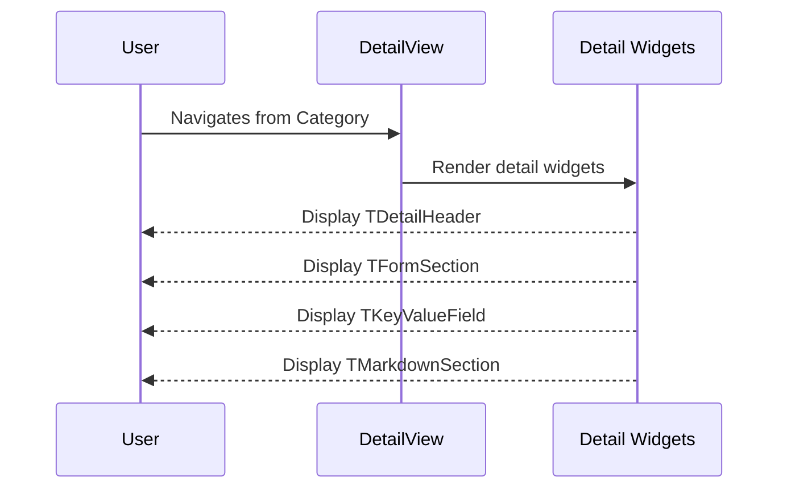

# 🧩 Components Template

Use this template for creating UI components/widgets and views in isolation. Components should be stateless with primitive parameters.

**Title Format**: `🧩 <Feature> UI components`

**Examples**:
- 🧩 User profile UI components
- 🧩 Checkout flow UI components

---

## 🔗 Dependencies
> Which tasks need to be completed first (if any)?

- [ ] 005-business-logic-navigation-routing

## 🗺️ User Journey
> What do the complete sequences look like with mermaid diagrams?

### User views Detail page with detail widgets

1. 👤 User navigates from Category to Detail page
2. 🧠 System renders Detail view
3. 🎨 Screen displays detail widgets



---

## 🧩 Components/Widgets
> What components/widgets need to be created and how do they look?

### DetailView (Create)

**Purpose:** Demonstrate all detail widget types

**Props/Parameters:**
- Uses TViewBuilder with DetailViewModel
- Receives detail ID from route parameters

**ASCII Representation:**
```
┌──────────────────────────────────────────┐
│ [← Back]  [Top Contextual Nav]           │
├──────────────────────────────────────────┤
│                                          │
│  ┌─ TDetailHeader ─────────────────────┐ │
│  │ Detail Title                        │ │
│  │ Subtitle / Metadata                 │ │
│  │ [Action Buttons]                    │ │
│  └─────────────────────────────────────┘ │
│                                          │
│  ┌─ TFormSection ──────────────────────┐ │
│  │ Section Title                       │ │
│  │ ┌──────────────────────────────┐    │ │
│  │ │ Form Field 1                 │    │ │
│  │ └──────────────────────────────┘    │ │
│  │ ┌──────────────────────────────┐    │ │
│  │ │ Form Field 2                 │    │ │
│  │ └──────────────────────────────┘    │ │
│  └─────────────────────────────────────┘ │
│                                          │
│  ┌─ TKeyValueField ────────────────────┐ │
│  │ Label: Value                        │ │
│  │ Label: Value                        │ │
│  │ Label: Value                        │ │
│  └─────────────────────────────────────┘ │
│                                          │
│  ┌─ TMarkdownSection ──────────────────┐ │
│  │ # Markdown Content                  │ │
│  │ Rendered markdown text...           │ │
│  └─────────────────────────────────────┘ │
│                                          │
├──────────────────────────────────────────┤
│ [Home Tab] [Playground Tab]              │
└──────────────────────────────────────────┘
```

**States:**
- Loading: Shows loading indicators
- Loaded: Displays detail widgets
- Error: Shows error message

---

## 🎨 Views
> What views/pages need to be created and how do they look?

### DetailView (Create)

New view demonstrating detail widgets:

1. **TDetailHeader**
   - Title from detail data
   - Subtitle/metadata
   - Optional action buttons

2. **TFormSection**
   - Section with form fields (read-only demo)
   - Shows form structure without actual form logic

3. **TKeyValueField**
   - Multiple key-value pairs
   - Shows metadata/properties

4. **TMarkdownSection**
   - Rendered markdown content
   - Shows rich text capabilities

---

## 🎨 Design Tokens
> What (existing) project design tokens are used, created, or updated?

Uses existing design tokens from theme.

---

## 📋 Storybook/Widgetbook
> Add components to the project's component showcase page

Components used are already in showcase. This task focuses on view implementation.

---

## Implementation Notes

### DetailView Structure

```dart
TViewBuilder<DetailViewModel>(
  viewModelBuilder: () => DetailViewModel(detailId: detailId),
  builder: (context, viewModel) => TSliverBody(
    slivers: [
      // Detail Header
      SliverToBoxAdapter(
        child: TDetailHeader(
          title: viewModel.title,
          subtitle: viewModel.subtitle,
          actions: [
            TButtonConfig(
              icon: Icons.edit,
              label: 'Edit',
              onPressed: viewModel.onEdit,
            ),
            TButtonConfig(
              icon: Icons.share,
              label: 'Share',
              onPressed: viewModel.onShare,
            ),
          ],
        ),
      ),
      // Form Section
      SliverToBoxAdapter(
        child: TFormSection(
          title: 'Details',
          children: [
            // Read-only form fields for demo
            TFormField(label: 'Name', value: viewModel.name),
            TFormField(label: 'Status', value: viewModel.status),
          ],
        ),
      ),
      // Key-Value Fields
      SliverToBoxAdapter(
        child: Column(
          children: [
            TKeyValueField(label: 'Created', value: viewModel.createdAt),
            TKeyValueField(label: 'Updated', value: viewModel.updatedAt),
            TKeyValueField(label: 'Author', value: viewModel.author),
          ],
        ),
      ),
      // Markdown Section
      SliverToBoxAdapter(
        child: TMarkdownSection(
          title: 'Description',
          content: viewModel.markdownContent,
        ),
      ),
    ],
  ),
);
```

### DetailViewModel

- Receives detailId from route
- Provides sample detail data
- Action handlers (edit, share - demo only, can show snackbar)

### Routing

- Route: `/home/category/:categoryId/detail/:detailId`

### Back Navigation

Use contextual back button registered for this route via ContextualButtonsService.

### Sample Markdown Content

```markdown
# Overview

This is a sample detail item demonstrating the **TMarkdownSection** widget.

## Features

- Renders markdown content
- Supports headings, lists, bold, italic
- Code blocks and links

## Usage

Use this widget to display rich text content in detail views.
```
