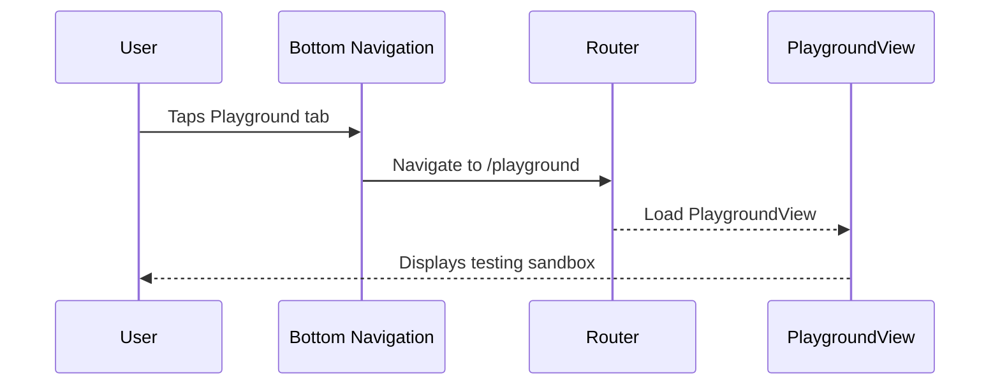

# 🧩 Components Template

Use this template for creating UI components/widgets and views in isolation. Components should be stateless with primitive parameters.

**Title Format**: `🧩 <Feature> UI components`

**Examples**:
- 🧩 User profile UI components
- 🧩 Checkout flow UI components

---

## 🔗 Dependencies
> Which tasks need to be completed first (if any)?

- [ ] 005-business-logic-navigation-routing

## 🗺️ User Journey
> What do the complete sequences look like with mermaid diagrams?

### User accesses Playground via bottom navigation

1. 👤 User taps Playground tab in bottom navigation
2. 🧠 System navigates to Playground
3. 🎨 Screen displays TPlayground component testing sandbox



---

## 🧩 Components/Widgets
> What components/widgets need to be created and how do they look?

### PlaygroundView (Update)

**Purpose:** Component testing sandbox accessible via bottom navigation

**Props/Parameters:**
- Uses TViewBuilder with PlaygroundViewModel
- Contains TPlayground widget

**ASCII Representation:**
```
┌──────────────────────────────────────────┐
│ [Top Contextual Nav - Styling button]    │
├──────────────────────────────────────────┤
│                                          │
│  ┌─ TPlayground ───────────────────────┐ │
│  │                                     │ │
│  │   Component Testing Sandbox         │ │
│  │                                     │ │
│  │   [Interactive component tests]     │ │
│  │                                     │ │
│  └─────────────────────────────────────┘ │
│                                          │
├──────────────────────────────────────────┤
│ [Home Tab] [Playground Tab ●]            │
└──────────────────────────────────────────┘
```

**States:**
- Default: Shows TPlayground content
- Active tab: Playground tab highlighted

---

## 🎨 Views
> What views/pages need to be created and how do they look?

### PlaygroundView (Update)

No major UI changes needed. Main change is:
1. Accessible via bottom navigation tab (not as child of Home)
2. Remove TSliverAppBar (handled in task 009)

---

## 🎨 Design Tokens
> What (existing) project design tokens are used, created, or updated?

Uses existing design tokens.

---

## 📋 Storybook/Widgetbook
> Add components to the project's component showcase page

No new components needed. TPlayground already exists.

---

## Implementation Notes

### Bottom Navigation Integration

PlaygroundView becomes a root-level shell branch:

```dart
StatefulShellRoute.indexedStack(
  branches: [
    // Home branch
    StatefulShellBranch(
      routes: [
        GoRoute(
          path: '/home',
          builder: (context, state) => const HomeView(),
          routes: [/* category, detail routes */],
        ),
      ],
    ),
    // Playground branch
    StatefulShellBranch(
      routes: [
        GoRoute(
          path: '/playground',
          builder: (context, state) => const PlaygroundView(),
        ),
      ],
    ),
  ],
)
```

### Bottom Navigation UI

```dart
TContextualBottomNavigation(
  buttons: {
    'home': TButtonConfig(
      icon: Icons.home,
      label: 'Home',
      onPressed: () => router.go('/home'),
    ),
    'playground': TButtonConfig(
      icon: Icons.science,
      label: 'Playground',
      onPressed: () => router.go('/playground'),
    ),
  },
  selectedKey: currentTab.name,
)
```

### NavigationTab Usage

```dart
// In ShellViewModel or equivalent
NavigationTab get currentTab {
  final location = router.location;
  if (location.startsWith('/playground')) return NavigationTab.playground;
  return NavigationTab.home;
}
```

---

## ✅ Acceptance Criteria

- [ ] Playground accessible via bottom navigation tab
- [ ] Bottom navigation shows Home and Playground tabs
- [ ] Playground tab correctly highlighted when active
- [ ] TPlayground content renders correctly
- [ ] No TSliverAppBar in PlaygroundView
