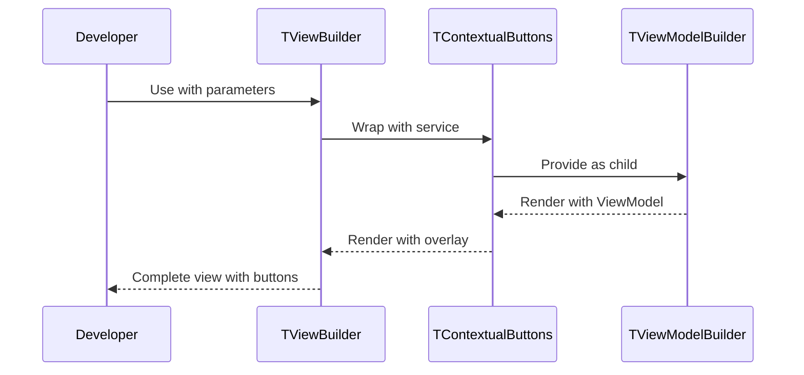

# 🧩 TViewBuilder widget

## 🔗 Dependencies
> Which tasks need to be completed first (if any)?

- [ ] 001-add-tviewbuilder-widget-constants

## 🗺️ User Journey
> What do the complete sequences look like with mermaid diagrams?

### Developer is able to create views with contextual buttons using single widget

1. 👤 Developer creates TViewBuilder with viewModel and service parameters
2. 🧠 TViewBuilder composes TContextualButtons → TViewModelBuilder
3. 🎨 View renders with contextual buttons overlay and ViewModel state



---

## 🧩 Components/Widgets
> What components/widgets need to be created and how do they look?

### TViewBuilder<T extends TViewModel>

**Purpose:** Convenience wrapper that combines TContextualButtons and TViewModelBuilder for views with contextual actions

**Props/Parameters:**
- `service`: TContextualButtonsServiceInterface? - Optional service for contextual buttons (null uses singleton)
- `child`: Widget? - Static child passed to TViewModelBuilder
- `builder`: Widget Function(BuildContext, T, bool, Widget?) - Builder function for view content
- `viewModelBuilder`: T Function() - Factory function that creates ViewModel instance
- `argumentBuilder`: Object? Function()? - Optional arguments for ViewModel initialization
- `isReactive`: bool - Whether to rebuild on notifyListeners (default: TurboMvvmConstants.isReactive)
- `shouldDispose`: bool - Whether to dispose ViewModel (default: TurboMvvmConstants.shouldDispose)
- `onDispose`: void Function(T)? - Callback when ViewModel disposes
- `key`: Key? - Widget key

**ASCII Representation:**
```
┌─────────────────────────────────────────┐
│  TViewBuilder                           │
│  ┌───────────────────────────────────┐  │
│  │ TContextualButtons                │  │
│  │ ┌─────────────────────────────┐   │  │
│  │ │ [Contextual buttons overlay]│   │  │
│  │ └─────────────────────────────┘   │  │
│  │ ┌─────────────────────────────┐   │  │
│  │ │ TViewModelBuilder           │   │  │
│  │ │ [View content with ViewModel]  │  │
│  │ └─────────────────────────────┘   │  │
│  └───────────────────────────────────┘  │
└─────────────────────────────────────────┘
```

**States:**
- Default: Both widgets render normally
- No Service: Falls back to TContextualButtonsService.instance singleton
- With Service: Uses provided custom service for contextual buttons
- ViewModel Not Initialized: TViewModelBuilder handles initialization state

---

## 🎨 Views
> What views/pages need to be created and how do they look?

N/A - This is a widget wrapper, not a complete view.

---

## 🎨 Design Tokens
> What (existing) project design tokens are used, created, or updated?

```json
{
  "note": "No design tokens created or modified - TViewBuilder is a pure composition wrapper",
  "used_from_turbo_mvvm": [
    "TurboMvvmConstants.isReactive",
    "TurboMvvmConstants.shouldDispose"
  ],
  "used_from_turbo_widgets": [
    "TContextualButtons existing configuration"
  ]
}
```

---

## 📋 Storybook/Widgetbook
> Add components to the project's component showcase page

- [ ] Add TViewBuilder usage example to turbo_widgets example app
- [ ] Demonstrate TViewBuilder with contextual buttons in different positions
- [ ] Show TViewBuilder without service (using singleton default)
