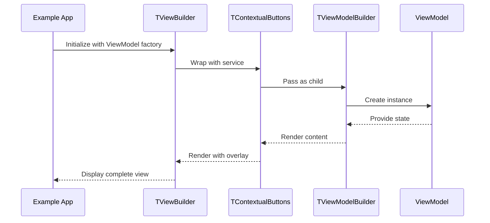

# 🔧 Wire TViewBuilder to example app and validate

## 🔗 Dependencies
> Which tasks need to be completed first (if any)?

- [ ] 001-add-tviewbuilder-widget-constants
- [ ] 002-add-tviewbuilder-widget-implementation

## 🎯 End Goal
> What is the tangible outcome of this integration?

TViewBuilder is integrated into the turbo_widgets example app with working examples demonstrating contextual button integration, and all package exports are properly configured.

## 📍 Currently
> What is the current state?

- TViewBuilder widget exists but is not demonstrated
- Widget is not exported from turbo_widgets package
- No usage examples exist for developers to reference
- turbo_widgets does not have turbo_mvvm as a dependency

## 🎯 Should
> What should the state be after implementation?

- TViewBuilder is exported from `turbo_widgets/lib/turbo_widgets.dart`
- TurboMvvmConstants is exported from `turbo_mvvm/lib/turbo_mvvm.dart`
- turbo_widgets pubspec.yaml includes turbo_mvvm dependency
- Example app in turbo_widgets demonstrates TViewBuilder usage
- All analysis passes without warnings
- Package can be published successfully

## 🔌 Integration Points
> What needs to be connected?

### Package Dependencies

| Package | Depends On | Connection |
|---------|-----------|------------|
| turbo_widgets | turbo_mvvm | Import TViewModelBuilder and TurboMvvmConstants |
| turbo_widgets/example | turbo_mvvm | Import TViewModel base class for example ViewModels |

### Widget Exports

| Package | Export File | Widget |
|---------|------------|--------|
| turbo_mvvm | lib/turbo_mvvm.dart | TurboMvvmConstants (add) |
| turbo_widgets | lib/turbo_widgets.dart | TViewBuilder (add) |

## 📈 Data Flow
> How does data flow through the integrated system?

## ✅ Acceptance Criteria
> How do we verify the integration works?

- [ ] TViewBuilder is exported from turbo_widgets
- [ ] TurboMvvmConstants is exported from turbo_mvvm
- [ ] turbo_widgets pubspec.yaml has turbo_mvvm dependency
- [ ] Example app demonstrates TViewBuilder with contextual buttons
- [ ] Example shows both with custom service and default singleton usage
- [ ] `dart analyze` passes for turbo_mvvm with 0 warnings/errors
- [ ] `dart analyze` passes for turbo_widgets with 0 warnings/errors
- [ ] Example app runs successfully

## ⚠️ Constraints
> What limitations or constraints exist?

- [ ] Must add turbo_mvvm to turbo_widgets dependencies with `resolution: workspace`
- [ ] Example app must already have turbo_mvvm in dependencies
- [ ] Widget must be exported after all other exports in turbo_widgets.dart
- [ ] Constants must be exported in turbo_mvvm.dart exports section

## 🧪 Integration Tests
> What integration tests verify the wiring?

- [ ] `Given TViewBuilder with ViewModel When rendered Then contextual buttons and ViewModel content both display`
- [ ] `Given TViewBuilder with service parameter When rendered Then custom service is used for contextual buttons`
- [ ] `Given TViewBuilder without service parameter When rendered Then singleton service is used (default behavior)`

## 📝 Notes
> Additional context for integration

The turbo_widgets example app already has infrastructure for demonstrating widgets. Add TViewBuilder example alongside existing widget demonstrations. Ensure the example ViewModel follows turbo_mvvm patterns (extends TViewModel, implements initialise/dispose).
