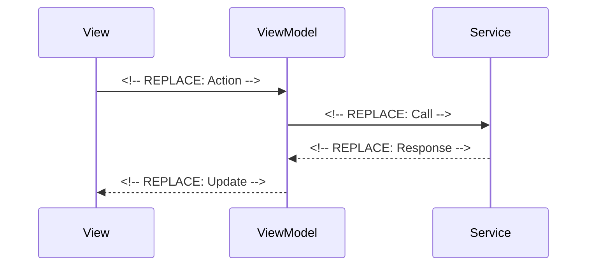
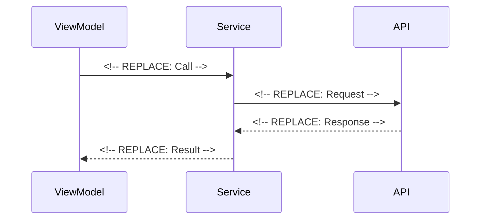

# ⚙️ Business Logic Template

Use this template for implementing ViewModels, Services, APIs, DTOs, and other business logic with unit tests. No UI work in this task type.

**Title Format**: `⚙️ <Feature> business logic`

**Examples**:
- ⚙️ User authentication business logic
- ⚙️ Payment processing business logic

---

## 🔗 Dependencies
> Which tasks need to be completed first (if any)?

- [ ] <!-- REPLACE: Task IDs that block this work -->

## 📈 Data Flow Diagrams
> How does data flow in ASCII/Mermaid?

```mermaid
<!-- REPLACE: Full data flow diagram -->
```

## 📦 Packages
> What packages need to be installed?

| Package | Version | Purpose |
|---------|---------|---------|
| <!-- REPLACE --> | <!-- REPLACE --> | <!-- REPLACE --> |

---

## 🧠 ViewModels
> What ViewModels need to be created and/or updated?

### <!-- REPLACE: ViewName -->ViewModel

**Purpose:** <!-- REPLACE: What state and logic does this ViewModel manage? -->

#### State
- [ ] `<!-- REPLACE: stateName -->`: <!-- REPLACE: type --> - <!-- REPLACE: description -->

#### Public Getters
- [ ] `<!-- REPLACE: getterName -->`: <!-- REPLACE: return type --> - <!-- REPLACE: description -->

#### Public Mutators
- [ ] `<!-- REPLACE: methodName -->`: <!-- REPLACE: parameters --> → <!-- REPLACE: return type --> - <!-- REPLACE: description -->

#### On Init
- [ ] <!-- REPLACE: Initialization step -->

#### On Dispose
- [ ] <!-- REPLACE: Cleanup step -->

#### TDD Gherkin Tests
- [ ] `Given <!-- REPLACE --> When <!-- REPLACE --> Then <!-- REPLACE -->`

#### View ↔ ViewModel Flow


---

## ⚙️ Services
> What Services need to be created and/or updated?

### <!-- REPLACE: ServiceName -->Service

**Purpose:** <!-- REPLACE: What business logic does this service handle? -->

#### State
- [ ] `<!-- REPLACE: stateName -->`: <!-- REPLACE: type --> - <!-- REPLACE: description -->

#### Public Getters
- [ ] `<!-- REPLACE: getterName -->`: <!-- REPLACE: return type --> - <!-- REPLACE: description -->

#### Public Mutators
- [ ] `<!-- REPLACE: methodName -->`: <!-- REPLACE: parameters --> → <!-- REPLACE: return type --> - <!-- REPLACE: description -->

#### On Init
- [ ] <!-- REPLACE: Initialization step -->

#### On Dispose
- [ ] <!-- REPLACE: Cleanup step -->

#### TDD Gherkin Tests
- [ ] `Given <!-- REPLACE --> When <!-- REPLACE --> Then <!-- REPLACE -->`

#### ViewModel → Service Flow


---

## 🌐 APIs
> What APIs need to be created and/or updated?

### <!-- REPLACE: ApiName -->Api

**Purpose:** <!-- REPLACE: What external endpoints does this API wrap? -->

#### Methods
- [ ] `<!-- REPLACE: methodName -->`: <!-- REPLACE: parameters --> → <!-- REPLACE: return type --> - <!-- REPLACE: description -->

---

## 📦 DTOs
> What DTOs need to be created and/or updated?

### <!-- REPLACE: DtoName -->Dto

```yaml
name: <!-- REPLACE: DtoName -->Dto
description: <!-- REPLACE: Short description of the DTO -->
locations:
  - <!-- REPLACE: Collections where dto is used -->
fields:
  <!-- REPLACE: fieldName -->:
    description: <!-- REPLACE: Description of the field -->
    type: <!-- REPLACE: string,number,boolean,map,array,null,timestamp,geopoint,reference -->
    required: <!-- REPLACE: true, false, or condition -->
    nullable: <!-- REPLACE: true or false -->
    default: <!-- REPLACE: Default value -->
    example: <!-- REPLACE: Example value -->
```

---

## 🏷️ Enums
> What enums need to be created and/or updated?

- [ ] **<!-- REPLACE: EnumName -->**
    - [ ] `<!-- REPLACE: enumValue1 -->`
    - [ ] `<!-- REPLACE: enumValue2 -->`

---

## 📌 Constants
> What constants are needed?

- [ ] **<!-- REPLACE: ConstantFamily -->**
    - [ ] `<!-- REPLACE: CONSTANT_NAME -->` = `<!-- REPLACE: value -->`

---

## 🌍 ARBs (Localization)
> What localized strings are needed?

| Key | EN | NL |
|-----|----|----|
| <!-- REPLACE --> | <!-- REPLACE --> | <!-- REPLACE --> |

---

## 🛠️ Utils
> What utility classes are needed?

- [ ] **<!-- REPLACE: UtilClassName -->** - <!-- REPLACE: Purpose -->
    - [ ] `<!-- REPLACE: methodName -->`: <!-- REPLACE: description -->

---

## 🧪 TDD Gherkin Unit Tests
> What cases verify our end goal is reached?

### <!-- REPLACE: TestSuiteName -->

- [ ] `Given <!-- REPLACE --> When <!-- REPLACE --> Then <!-- REPLACE -->`
- [ ] `Given <!-- REPLACE --> When <!-- REPLACE --> Then <!-- REPLACE -->`
