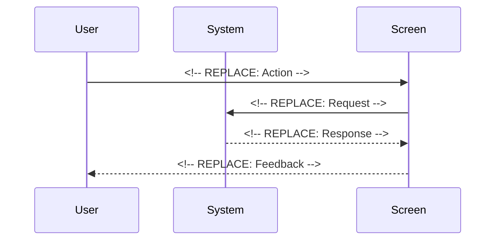

# 🧩 Components Template

Use this template for creating UI components/widgets and views in isolation. Components should be stateless with primitive parameters.

**Title Format**: `🧩 <Feature> UI components`

**Examples**:
- 🧩 User profile UI components
- 🧩 Checkout flow UI components

---

## 🔗 Dependencies
> Which tasks need to be completed first (if any)?

- [ ] <!-- REPLACE: Task IDs that block this work -->

## 🗺️ User Journey
> What do the complete sequences look like with mermaid diagrams?

### <!-- REPLACE: Scenario Name --> {Actor} is able to [outcome/state achieved]

1. 👤 User [verb] ...
2. 🧠 System [verb] ...
3. 🎨 Screen [verb] ...



---

## 🧩 Components/Widgets
> What components/widgets need to be created and how do they look?

### <!-- REPLACE: ComponentName -->

**Purpose:** <!-- REPLACE: What this component does -->

**Props/Parameters:**
- `<!-- REPLACE: propName -->`: <!-- REPLACE: type --> - <!-- REPLACE: description -->

**ASCII Representation:**
```
┌─────────────────────────────────────────┐
│                                         │
│  <!-- REPLACE: ASCII mockup -->         │
│                                         │
└─────────────────────────────────────────┘
```

**States:**
- Default: <!-- REPLACE: Description -->
- Hover: <!-- REPLACE: Description -->
- Active: <!-- REPLACE: Description -->
- Disabled: <!-- REPLACE: Description -->
- Error: <!-- REPLACE: Description -->

---

## 🎨 Views
> What views/pages need to be created and how do they look?

### <!-- REPLACE: ViewName -->View

**Purpose:** <!-- REPLACE: What this view displays -->

**Route:** <!-- REPLACE: /path/to/view -->

**ASCII Representation:**
```
┌─────────────────────────────────────────────────────────────┐
│ ┌─────────────────────────────────────────────────────────┐ │
│ │ Header                                                  │ │
│ └─────────────────────────────────────────────────────────┘ │
│                                                             │
│ ┌─────────────────────────────────────────────────────────┐ │
│ │                                                         │ │
│ │  <!-- REPLACE: Main content area ASCII mockup -->       │ │
│ │                                                         │ │
│ └─────────────────────────────────────────────────────────┘ │
│                                                             │
│ ┌─────────────────────────────────────────────────────────┐ │
│ │ Footer                                                  │ │
│ └─────────────────────────────────────────────────────────┘ │
└─────────────────────────────────────────────────────────────┘
```

**View States:**
- Loading: <!-- REPLACE: Description -->
- Empty: <!-- REPLACE: Description -->
- Error: <!-- REPLACE: Description -->
- Success: <!-- REPLACE: Description -->

**Components Used:**
- <!-- REPLACE: ComponentName -->
- <!-- REPLACE: ComponentName -->

---

## 🎨 Design Tokens
> What (existing) project design tokens are used, created, or updated?

```json
<!-- REPLACE: design tokens used, created and/or updated -->
```

---

## 📋 Storybook/Widgetbook
> Add components to the project's component showcase page

- [ ] Add <!-- REPLACE: ComponentName --> to Storybook/Widgetbook
- [ ] Document all component states and variants
- [ ] Ensure primitive parameters only (no custom objects)
