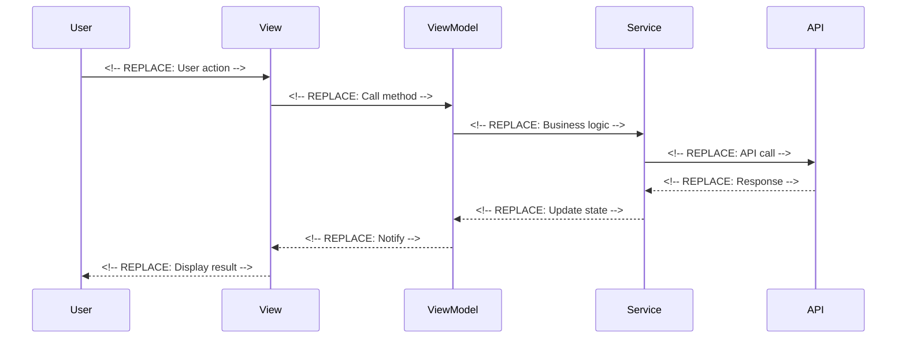

# 🔧 Implementation Template

Use this template for wiring components to business logic and integration work. Assumes components are created and business logic is tested.

**Title Format**: `🔧 Wire <feature> to business logic`

**Examples**:
- 🔧 Wire user profile to ProfileViewModel
- 🔧 Wire checkout flow to PaymentService

---

## 🔗 Dependencies
> Which tasks need to be completed first (if any)?

- [ ] <!-- REPLACE: components task ID -->
- [ ] <!-- REPLACE: business-logic task ID -->

## 🎯 End Goal
> What is the tangible outcome of this integration?

<!-- REPLACE: Clear description of what will work end-to-end after this task -->

## 📍 Currently
> What is the current state?

- Components exist but are not connected to data
- Business logic is tested but not wired to UI
- <!-- REPLACE: Other current state items -->

## 🎯 Should
> What should the state be after implementation?

- Components receive real data from ViewModels/Services
- User actions trigger business logic
- Data flows end-to-end from UI to backend
- <!-- REPLACE: Other expected outcomes -->

## 🔌 Integration Points
> What needs to be connected?

### View ↔ ViewModel Connections

| View | ViewModel | Connection |
|------|-----------|------------|
| <!-- REPLACE: ViewName --> | <!-- REPLACE: ViewModelName --> | <!-- REPLACE: What data/actions --> |

### Component ↔ State Connections

| Component | State Source | Data Flow |
|-----------|--------------|-----------|
| <!-- REPLACE: ComponentName --> | <!-- REPLACE: ViewModel/Service --> | <!-- REPLACE: What data --> |

## 📈 Data Flow
> How does data flow through the integrated system?

## ✅ Acceptance Criteria
> How do we verify the integration works?

- [ ] User can <!-- REPLACE: Complete user action -->
- [ ] Data persists correctly
- [ ] Error states are handled
- [ ] Loading states display correctly

## ⚠️ Constraints
> What limitations or constraints exist?

- [ ] <!-- REPLACE: Constraint 1 -->

## 🧪 Integration Tests
> What integration tests verify the wiring?

- [ ] `Given <!-- REPLACE --> When <!-- REPLACE --> Then <!-- REPLACE -->`

## 📝 Notes
> Additional context for integration

<!-- REPLACE: Any gotchas, edge cases, or special considerations -->
